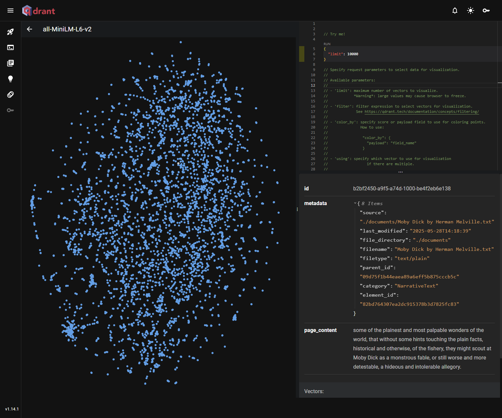

# RAG-Talk

RAG-Talk is an interactive web application that combines the power of Large Language Models (LLMs) with Retrieval-Augmented Generation (RAG) to deliver intelligent, context-aware conversations. It allows users to chat directly with a local LLM or enhance their queries with document-backed retrieval for precise, grounded responses. The interface supports file uploads and copy-paste input, enabling custom context ingestion via embedding models.

With support for streaming responses, dynamic model selection, and rich formatting (Markdown and LaTeX), RAG-Talk is ideal for exploring conversational AI grounded in your own documents — from policies and manuals to research papers and beyond.

## System Architecture

### Embedding

Embedding is the process of transforming raw data—such as words, sentences, or documents—into numerical vectors. These vectors represent the semantic meaning of that data in a continuous, high-dimensional space. This means that similar meanings are close together in the vector space—even if the words are different. For example, embeddings allow systems to identify that "cat" and "kitten" are more similar than "cat" and "car". This enables machines to compare and reason about language in a more meaningful way than using raw text.

To maintain modularity and scalability, RAG-Talk is designed to support `remote embedding` inference. Instead of performing embedding computations locally, RAG-Talk sends text data over HTTP to a dedicated embedding server—typically running on a host with GPU acceleration. This separation allows embedding workloads to be isolated from the main application, ensuring better performance, efficient GPU utilization, and easier horizontal scaling. The main application simply sends a request and receives a semantic vector in response, making it easy to plug in different embedding models or upgrade hardware independently of the rest of the system.

Similarly, the LLM backend—powered by Ollama—can also run on a separate server. This decoupling means RAG-Talk can communicate with powerful language models hosted elsewhere, whether on-premise or in the cloud. This architecture provides flexibility: developers can use lightweight machines for the web interface and delegate heavy model inference to machines with specialized resources like GPUs. It also opens the door for model multiplexing and centralized model orchestration, without complicating the frontend experience.

### Embedding Models

Embedding models are machine learning models trained to generate these semantic vector representations. They learn from large text corpora to map similar pieces of text closer together in the vector space. Different models specialize in various tasks. Some focus on multilingual understanding (like `bge-large`), while others are optimized for speed or retrieval quality (like OpenAI’s `text-embedding-3-small`). These models power applications like semantic search, document clusterning, recommendation systems, and RAG.

RAG-Talk supports multiple remote embedding models, allowing users to choose the one that best fits their use case—whether prioritizing speed, accuracy, or semantic depth. This flexibility enables users to experiment with different semantic behaviors or optimize performance by switching models on the fly.

| Model Name          | Description                                                                 |
|---------------------|-----------------------------------------------------------------------------|
| all-MiniLM-L6-v2    | Lightweight and fast. Ideal for real-time use where lower latency is key.   |
| all-MiniLM-L12-v2   | Slightly larger than L6, offers improved semantic quality.                  |
| bge-base-en-v1.5    | Balanced performance and accuracy; suitable for general-purpose retrieval.  |
| bge-large-en-v1.5   | High-accuracy model for deep semantic understanding; best for RAG tasks.    |

RAG-Talk uses [SentenceTransformer](https://sbert.net/), a powerful library built on top of Hugging Face Transformers and PyTorch, to generate embeddings for text segments. This abstraction enables the project to convert user documents and queries into dense semantic vectors suitable for retrieval and comparison. SentenceTransformer simplifies the embedding workflow by wrapping pre-trained [transformer models](https://huggingface.co/models?library=sentence-transformers) with optimized pooling and encoding strategies, while also supporting GPU acceleration for efficient processing.

It’s important to note that if a user switches to a different embedding model, any previously ingested documents must be reprocessed using the new model. Each embedding model has its own vector space—meaning vectors generated by one model are not comparable to vectors generated by another. As a result, documents embedded with an old model are no longer relevant or retrievable under the new one. RAG-Talk treats each embedding model as a separate namespace in the vector store, ensuring that search and retrieval are always consistent and accurate within a given embedding context.

### Vector Store Databases

A vector store is a specialized database designed to store, index, and search high-dimensional vectors. After embedding your data, you can store those vectors in a vector store and perform fast similarity searches to find the most relevant results for a given query.

There are many options for [vector store databases](https://db-engines.com/en/ranking/vector+dbms), ranging from search engines with vector support like `Elasticsearch` and `OpenSearch`, to traditional databases extended with vector capabilities such as PostgreSQL with `pgvector`, MongoDB Atlas, and Redis. However, our focus here is on open-source vector databases that support local deployment, offering flexibility, privacy, and full control over the infrastructure.

| Vector Store | Year Introduced  | Deployment Options        | API Type           | Best For                           |
|--------------|------------------|---------------------------|--------------------|------------------------------------|
| **FAISS**    | 2017             | Local only                | Python/C++ API     | Local, small to medium-scale use   |
| **Milvus**   | 2019             | Local, Kubernetes, Cloud  | REST/gRPC/SDK      | Large-scale vector search          |
| **Weaviate** | 2020             | Local, Cloud, SaaS        | REST/gRPC/GraphQL  | Multi-modal + hybrid search setups |
| **Qdrant**   | 2021             | Local, Docker, Cloud      | REST/gRPC          | Hybrid vector + metadata search    |
| **Chroma**   | 2023             | Local only (dev-focused)  | Python API         | Rapid prototyping & dev workflows  |

`FAISS`, developed by Meta, is a fast, in-memory vector search library best suited for local use cases where low-latency retrieval and full control over data are key, though it lacks native filtering and distributed capabilities. `Milvus` is a scalable vector database designed for large-scale production workloads, supporting disk-based storage, Kubernetes orchestration, and multiple index types, making it ideal for high-throughput enterprise applications. `Weaviate` offers a flexible and schema-driven system with built-in machine learning models, hybrid search (text + vector), and support for GraphQL, making it well-suited for multi-modal search and semantic applications. `Chroma`, in contrast, is a lightweight and developer-friendly option focused on local development and rapid prototyping, offering simple Python APIs and minimal setup for testing vector workflows.

#### Qdrant

`Qdrant` stands out as a powerful open-source vector database that combines fast vector similarity search with advanced metadata filtering, making it ideal for hybrid search applications. It features a clean REST and gRPC API, rich filtering capabilities, and payload indexing, enabling precise control over both vector and structured data. Its balance of performance, ease of use, and production readiness makes Qdrant a good choice for applications that require scalable vector search tightly integrated with metadata filtering.

Unlike some alternatives, Qdrant supports local deployment via Docker, as well as managed cloud options. Running Qdrant inside a container ensures clean separation of concerns and easier deployment. This encapsulation provides operational flexibility, making it easy to scale, upgrade, or isolate the vector store without affecting other parts of the system. It also aligns with the microservice-oriented nature of RAG-Talk, allowing independent control over data storage and compute layers.

#### Embedding Model Collections in Qdrant

Each embedding model supported by RAG-Talk is mapped to a unique `collection` inside Qdrant. These collections are configured with the corresponding vector size (i.e., the output dimensionality of the embedding model) and use `cosine` similarity as the distance metric for semantic comparisons. This design ensures that embeddings from different models are not mixed, preserving the integrity of the retrieval process. When a user switches to a new model, a new collection is used automatically, making it easy to maintain clean, isolated retrieval spaces per model.

#### Deduplication via MD5 Hashing

To prevent duplicate content from being stored and embedded multiple times, RAG-Talk uses a deduplication technique based on MD5 hashing. Before any document chunk is added to Qdrant, its content is hashed and compared against existing hashes. If the hash already exists, the document is skipped. This mechanism reduces unnecessary storage, avoids redundant computation, and ensures that retrieval results remain meaningful and diverse. The MD5-based approach is lightweight, fast, and effective for most use cases involving text document ingestion.

### Document Load and Split

In the RAG-Talk project, the document ingestion pipeline begins with the use of `UnstructuredLoader`, a powerful utility from the `langchain_unstructured` module that supports a wide range of file formats—including `.txt`, `.pdf`, `.docx`, `.html`, and more. This loader automatically extracts clean, structured content from these formats without requiring manual parsing logic for each file type. This not only simplifies integration with various document sources but also ensures consistent and reliable text extraction across heterogeneous data formats, which is essential for robust RAG systems.

After loading the documents, we use the `RecursiveCharacterTextSplitter` to divide the content into manageable chunks. This splitter intelligently breaks down long documents by recursively looking for natural split points—such as paragraph breaks or sentence boundaries—before resorting to fixed-size chunks.

We have configured the text splitter with a `chunk size` of 1000 and a `chunk overlap` of 200, which provides an effective balance between semantic coherence and retrieval performance. Each chunk contains up to 1000 characters, and the 200-character overlap ensures contextual continuity between adjacent chunks—minimizing the risk of splitting important information across chunk boundaries. The optimal choice of chunk_size and chunk_overlap depends on several factors, including the capabilities of the embedding model, the structure of the source documents, and the target use case (e.g., semantic search vs. document Q&A).

## Getting Started

Build the Docker images for the project:

    docker compose build

Start all the containers:

    docker compose up -d

Allow up to one minute for the `rag-talk` container to fully initialize and start the application server. The `rag-talk` backend can connect to ollama, qdrant, and embed-server either locally within Docker or externally across hosts (e.g., in production or distributed deployment). In latter case, update the service endpoint URLs in [config.py](core/config.py) as needed.

These URLs provide access to different parts of the `rag-talk`:

- Web Interface: http://localhost:8000/
- Swagger API docs: http://localhost:8000/api/docs
- API Base URL: http://localhost:8000/api/v1/

### Setting up Ollama Server

Open an interactive shell to the container:

    docker exec -it ollama_rag bash

Run the following to confirm that the container has access to the host GPU:

    nvidia-smi

This should return a table showing your GPU, driver version, and usage.

You can also check `docker logs ollama_rag` to ensure that the GPU is detected.

Pull a LLM model:

    ollama pull llama3:8b

### Setting up Embedding Server

To verify that GPU support is working inside the `embed-server` container, open an interactive shell to the container:

    docker exec -it embed-server bash

Run the following to confirm that the container has access to the host GPU:

    nvidia-smi

Confirm that CUDA is available in Python:

    python3 -c "import torch; print(torch.cuda.is_available())"

This should print `True` if PyTorch detects a CUDA-compatible GPU.

## API Endpoints

RAG-Talk exposes a set of RESTful API endpoints grouped into two categories:

- **LLM Endpoints**: For direct interaction with large language models.

    | Method | Endpoint             | Description                                                             |
    |--------|----------------------|-------------------------------------------------------------------------|
    | GET    | /llm/models          | Returns list of available LLM models from the Ollama backend            |
    | POST   | /llm/chat            | Sends a question to the selected LLM model and returns full response    |
    | POST   | /llm/chat-stream     | Same as `/chat`, but returns streamed output as text chunks             |

- **RAG Endpoints**: For document-enhanced retrieval-augmented generation.

    | Method | Endpoint             | Description                                                             |
    |--------|----------------------|-------------------------------------------------------------------------|
    | GET    | /rag/embeddings      | Lists available embedding models served by the embedding server         |
    | GET    | /rag/debug-search    | Performs a raw semantic search and returns the top matching documents   |
    | POST   | /rag/upload          | Uploads a document to be embedded, and added to vector store            |
    | POST   | /rag/paste           | Accepts pasted document text to embed and store                         |
    | POST   | /rag/chat            | Performs retrieval-augmented chat using the selected embedding          |
    | POST   | /rag/chat-stream     | Same as `/rag/chat`, but streams the model's response in real-time      |

Streaming responses allow the language model to return output incrementally—token by token—rather than waiting for the entire answer to be generated before sending it. This creates a more interactive and responsive user experience, especially for longer answers, as users can begin reading the model's reply almost immediately. In RAG-Talk, streaming is supported for both direct LLM chat and RAG-based responses.

For example, to retrieve a list of supported LLM models, you can use the following `curl` command:

    curl -X GET http://localhost:8000/api/v1/llm/models

Example response:

    {
        "models": [
            "llava-phi3:latest",
            "llava-llama3:latest",
            "llava:latest",
            "llama3.1:8b",
            "llama3:8b"
        ]
    }

To retrieve a list of supported embedding models, you can use the following `curl` commands:

    curl -X GET http://localhost:8000/api/v1/rag/embeddings

Example response:

    {
        "models": [
            "all-MiniLM-L6-v2",
            "all-MiniLM-L12-v2",
            "bge-base-en-v1.5",
            "bge-large-en-v1.5"
        ]
    }

## Front-end

The RAG-Talk web interface is designed to provide an intuitive experience for users interacting with local LLMs and RAG pipelines. The application interface is divided into two main tabs: LLM and RAG, each tailored to a specific mode of interaction.

### LLM Tab

The LLM tab enables users to interact directly with a selected language model. The frontend automatically fetches and populates the list of available LLMs by querying the backend, ensuring users can always choose from the latest configured models. Users can input a question and optionally enable streaming mode to receive the response in real time as it's generated.

A session ID field allows users to maintain conversation state across multiple turns. This is made possible through an in-memory message history implementation in the backend, leveraging `RunnableWithMessageHistory` from LangChain. This approach allows RAG-Talk to maintain contextual continuity without relying on persistent databases, which is particularly useful for short-lived or ephemeral sessions.

### RAG Tab

The RAG tab supports document-augmented question answering. The frontend dynamically populates the list of supported embedding models by querying a dedicated remote embedding server. Users can either upload files (e.g., PDFs or text documents) or copy-paste plain text into a designated area. Once submitted, the backend processes this input by converting it into vector embeddings and storing them in Qdrant vector database.

Additionally, users can provide custom instructions to guide the LLM's behavior during response generation. These instructions can define tone, constraints, or specific expectations, enhancing the quality and relevance of answers produced through RAG.

## Visualization, and Performance Monitoring

To test document ingestion and retrieval, plain-text books from [Project Gutenberg](https://www.gutenberg.org/) offer an excellent resource. These books are in the public domain and typically contain hundreds of pages of clean, structured text without any images or complex formatting. For example, [The Evolution of Modern Medicine by William Osler](https://www.gutenberg.org/ebooks/1566) (approximately 300 pages) can be downloaded in text format and uploaded through the RAG interface. Once submitted, the backend processes the document—loading, chunking, embedding, and storing it into Qdrant.

| Parameter       | Value                 |
|-----------------|-----------------------|
| chunk_size      | `1000`                |
| chunk_overlap   | `200`                 |
| llm_model       | `llama3.1:8b`         |
| embedding_model | `bge-large-en-v1.5`   |
| search_type     | `similarity`          |
| k               | `15`                  |

Last but not least, the following instruction is used:

    You are a helpful assistant. Use the context provided below to answer the question as accurately as possible.
    If you are unsure or the answer is not clearly present in the context, respond with "I don't know."
    Keep your answers concise and factual.

One of the standout features of Qdrant is its built-in web dashboard, which offers tools for inspecting and managing data stored in the vector database. The dashboard provides a user-friendly interface for navigating collections, monitoring indexed documents, and understanding how embeddings are distributed. One particularly useful capability is the visualization of vector distributions for each collection. This feature allows developers and researchers to intuitively explore the structure and density of embedded data points in a high-dimensional space, providing insight into how well the content is clustered or separated semantically.

With the book embedded and indexed, users can now ask natural language questions about its content using the RAG interface. For example, a query like **"How did Galen influence medical theory in the Middle Ages?"** would retrieve relevant context from the embedded passages and feed it to the LLM to generate a response.

During this interaction, especially when using a GPU-accelerated inference model, it's insightful to observe GPU telemetry data such as power usage, core utilization, and VRAM consumption. These metrics demonstrate how the model is leveraging hardware resources in real time, confirming that the GPU is actively involved in processing the query and generating a response.

For deeper insights into system performance during inference, refer to my telemetry monitoring project, which provides tools and dashboards to track and visualize GPU usage.

## Benchmarking

`TODO`
